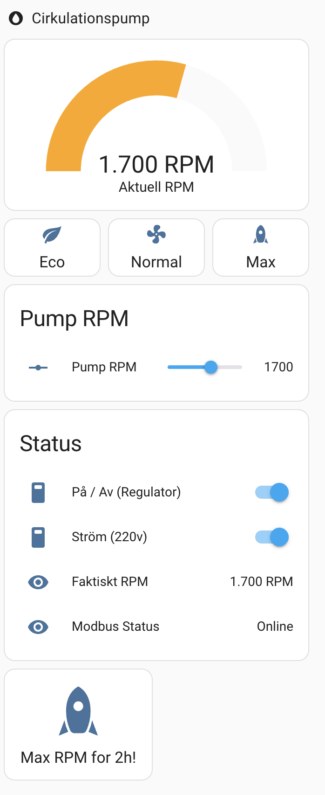
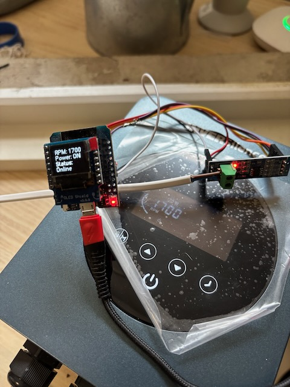
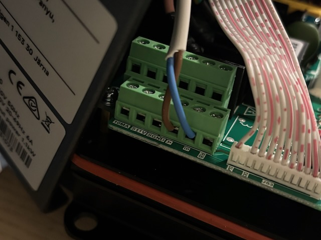

> ⚠️ This project builds on work originally shared by **milwhite** in this [Home Assistant community post](https://community.home-assistant.io/t/isaver-pool-pump-speed-control-modbus-waveshare-usb-to-rs485/582508).

# ha-esp32-variable-speed-drive-esphome

[](https://www.home-assistant.io)

Control a variable speed drive (such as the iSAVER+ 1100) using an ESP32 and ESPHome, fully integrated with Home Assistant. This setup lets you read actual RPM, set speed, and control power via Modbus over RS485.


### ⚠️ Disclaimer

This configuration has only been tested on the following device:

🔗 [InverSilence iSAVER+ 1100 – Folkpool](https://www.folkpool.se/produkter/pool/cirkulationssystemet/frekvensstyrningar-och-tillbehor/inversilence-1-fas-varvtalsstyrning-power-1100.html)

I take **no responsibility** for how this setup might impact your device. Use it at your own risk. Your specific model **may not be compatible**, and incorrect usage might damage your equipment.

If you do manage to get it working with a different variable speed drive, I’d love to hear about it — your feedback could help others in the community!


## 🛠️ Hardware

### 🧾 Bill of Materials (BOM)

| Item                                | Description                                                  | Example / Link                                                                                      |
|-------------------------------------|--------------------------------------------------------------|------------------------------------------------------------------------------------------------------|
| **ESP32 Dev Board**                | Main controller running ESPHome                             | [HiLetgo ESP32 Dev Board](https://www.amazon.com/HiLetgo-Development-ESP8285-Wireless-Internet/dp/B07BK435ZW) |
| **RS485 to UART Module**           | For Modbus communication over UART                          | [MAX485 RS485 Module](https://www.amazon.com/Max485-Chip-RS-485-Module-Raspberry/dp/B00NIOLNAG/)    |
| **Variable Speed Drive**           | The pump controller we're interfacing with                  | [iSAVER+ 1100 (or similar)](https://www.google.com/search?q=isaver%2B+1100)                         |
| **Dupont cables / breadboard wires**| For connecting components                                    | Any female-to-female and male-to-male jumper wires                                                  |
| **Power supply**                   | 5V USB power for ESP32                                       | e.g. phone charger, USB power brick                                                                 |

## 📡 ESPHome Configuration

The ESPHome YAML file is in [`esphome/isaver.yaml`](esphome/isaver.yaml).

To use it:

1. Replace WiFi credentials in your `secrets.yaml`
2. Flash your ESP32
3. Add the device to Home Assistant
4. Optionally adjust the Modbus logic to fit your specific drive

## 💡 Dashboard Preview

Here’s what the finished control panel looks like in Home Assistant:



## 🏡 Home Assistant Integration

You can use the exposed `number`, `sensor`, `switch`, and `button` entities directly in dashboards or automations.

### Lovelace Files

| File                      | Description                            |
|---------------------------|----------------------------------------|
| `gauge.yaml`              | RPM gauge                              |
| `preset_buttons.yaml`     | ECO / NORMAL / MAX speed buttons       |
| `status_panel.yaml`       | On/off switch, actual RPM, Modbus info |
| `max_rpm_button.yaml`     | Triggers 2-hour Max RPM script         |

Lovelace files are in [`examples/lovelace/`](examples/lovelace/)

## 🧪 Bonus: Temporary Max Speed Script

To enable the “Max RPM for 2h!” button, create this in your `scripts.yaml` or load it from [`examples/scripts/`](examples/scripts/):

```yaml
alias: Pump Max Then Restore
mode: single
sequence:
  - variables:
      previous: "{{ states('number.pump_rpm_regulator_pool_pump_rpm') | int }}"
  - service: number.set_value
    target:
      entity_id: number.pump_rpm_regulator_pool_pump_rpm
    data:
      value: 2900
  - delay: "02:00:00"
  - service: number.set_value
    target:
      entity_id: number.pump_rpm_regulator_pool_pump_rpm
    data:
      value: "{{ previous }}"
```

## 📁 Folder Structure

```
ha-esp32-variable-speed-drive-esphome/
├── README.md
├── LICENSE
├── .gitignore
├── esphome/
│   └── isaver.yaml
├── docs/
│   └── 
├── examples/
│   ├── lovelace/
│   │   ├── gauge.yaml
│   │   ├── preset_buttons.yaml
│   │   ├── status_panel.yaml
│   │   └── max_rpm_button.yaml
│   └── scripts/
│       └── pump_max_then_restore.yaml
└── images/
    └── pump.png
```

## 🔌 Wiring Diagram (ASCII)

### ⚠️ Important Wiring Note

> GPIO5 (IO5) on the ESP32 **must be connected to both the RE and DE pins** on the RS485 module.  
> This ensures proper direction control for Modbus communication.


```
                          RS485
   ESP32                  Module B              Variable Speed Drive
+---------+           +-----------+           +----------------------+
|         |           |          A|   ---->   | A                    |
|      17 +---------->+ DI        |           |                      |
|         |           |          B|   ---->   | B                    |
|      16 +<----------+ RO        |           +----------------------+
|         |           |           |
|       5 +---------->+  RE/DE    |
|         |           |   GND     |
+---------+           +-----------+
                           |
                           |
                          GND
```

## 🧠 How It Works

This ESPHome config sends and receives Modbus messages over UART using a custom lambda. It sets the desired RPM via a Modbus write and reads the current RPM in a loop.

A GPIO pin is used to toggle the RS485 write-enable line before/after communication to avoid collisions.


## 💧 Smarter Pool Pump Scheduling

GoNow when you have variable speed pump you might want to save energy *and* keep things quiet? We've put together a simple example that helps you figure out a daily schedule based on your pool size and pump settings.

Check it out here:  
👉 [docs/example_schedule.md](docs/example_schedule.md)

It shows:
- How to calculate how much water your pump needs to move
- What different RPMs mean for flow and power use
- A sample schedule that keeps things clean without wasting energy






